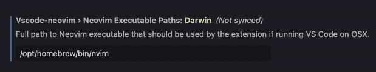

Neovim을 쓴 지 반 년 정도 되었다. Neovim의 플러그인과 단축키에 익숙해진 후, 다른 에디터에서 느낄 수 없었던 짱편한 편집 기능을 누리며 코딩을 할 수 있었다. 하지만 회사에서 사용하기에 눈치가 보인다는 점과 플러그인이 업데이트 될 때마다 현재 기능이 깨지지 않는지 확인해야 하는 불편함이 있어서 vscode를 다시 사용해보기로 했다.

다만 neovim을 사용한 워크플로우에 너무 익숙해져 있었기 때문에 VSCode에서 최대한 동일한 워크플로우를 실현할 수 있도록 설정해야 했고, VSCode Neovim 플러그인과 몇 가지 단축키 설정으로 내가 사용하던 neovim과 비슷하게 설정이 가능했다.

# VSCode Neovim

VSCode에는 vim의 단축키를 쓸 수 있는 플러그인이 있다. 보통은 [VSCode Vim](https://github.com/VSCodeVim/Vim)을 많이 쓰는 것 같지만 나는 [VSCode Neovim](https://marketplace.visualstudio.com/items?itemName=asvetliakov.vscode-neovim)을 쓰기로 했다. 이 둘은 vim 단축키를 지원한다는 점에서 비슷하지만, VSCode Vim은 VSCode 위에서 Vim을 구현한 에뮬레이터이고 VSCode Neovim은 내 로컬 환경에 설치된 neovim을 vscode 위에서 사용할 수 있게 해주는 굉장한 녀석이다. 즉, 내가 사용하던 neovim 플러그인들을 vscode 위에서도 사용할 수 있다!

# Setup

VSCode Neovim을 사용하기 위해서는 로컬에 설치된 neovim이 필요하다. 나는 neovim v0.8.0을 사용하고 있다. 그 다음 VSCode Neovim 플러그인을 설치하면 얘가 알아서 neovim을 인식하는 것 같다. 인식이 안되면 플러그인 설정에서 neovim 실행 파일의 위치를 넣어줘야 한다.



VSCode Neovim은 로컬 neovim의 설정 파일 (`init.vim` 또는 `init.lua`)를 읽어 설정을 적용시킨다. 하지만 VSCode 위에서 적용되지 않는 플러그인이 있기 때문에 안정성을 위해 'vim.g.vscode` 값을 사용해 vscode 환경의 설정과 로컬 neovim의 설정을 분리하는 것을 추천한다.

```lua
return require("packer").startup(function(use)
    use("wbthomason/packer.nvim")
    use("nvim-lua/plenary.nvim")
    use("bkad/CamelCaseMotion")
    use("tpope/vim-surround")
    use("tpope/vim-commentary")
    use("ggandor/leap.nvim")
    use("tpope/vim-repeat")

    --- for native neovim (not vscode)
    if not vim.g.vscode then
      ---  ...
    end

    if packer_bootstrap then
        require("packer").sync()
    end
end)
```

# Migration

## Plugins

내가 VSCode nvim에 추가한 플러그인은 아래와 같다.

- [CamelCaseMotion](https://github.com/bkad/CamelCaseMotion): camel case 또는 snake case의 모션을 제공한다. 예를 들어, CamelCase의 첫 번째 글자 C에 커서를 두고 d-i-w 커맨드로 'Camel'을 삭제할 수 있다.
- [vim-surround](https://github.com/tpope/vim-surround): 괄호, 따옴표, 태그 등을 추가, 삭제, 교체하는 기능을 제공한다.
- [vim-commentary](https://github.com/tpope/vim-commentary): 선택된 영역을 한꺼번에 comment-out 할 수 있다.
- [leap.nvim](https://github.com/ggandor/leap.nvim): 현재 문서 안에서 가고 싶은 것으로 빠르게 이동할 수 있다.
  (VSCode에서 leap.nvim을 사용할 수 있다니!)
- [vim-repeat](https://github.com/tpope/vim-repeat): `.` 커맨드의 확장판

## jk, kj로 입력모드 벗어나기

Settings에 아래와 같이 추가하면 `jj`, `jk`, `kj` 명령어로 입력 모드를 벗어날 수 있다.

```json
{
    "command": "vscode-neovim.compositeEscape1",
    "key": "j",
    "when": "neovim.mode == insert && editorTextFocus",
    "args": "j"
},
{
    "command": "vscode-neovim.compositeEscape2",
    "key": "k",
    "when": "neovim.mode == insert && editorTextFocus",
    "args": "k"
}
```

## 클립보드에 복사하기

Neovim에서는 [ojroques/vim-oscyank](https://github.com/ojroques/vim-oscyank) 플러그인을 사용하여 클립보드에 복사했지만 VSCode에서는 동작하지 않는 것 같다. Neovim 설정 파일에 아래와 같이 추가해주면 `y` 커맨드로 yank할 때 클립보드에 복사되어, `cmd-v`로 붙여넣기 할 수 있다.

```lua
if vim.g.vscode then
    vim.o.clipboard = "unnamedplus"
end
```

## Pane 및 Tab 관리

Neovim에서 `Ctrl+w+l`, `Ctrl+w+h`로 수직으로 나뉜 pane끼리 이동할 수 있었다. VSCode에서 editor group을 이동할 때 같은 커맨드를 사용하기 위해 아래와 같이 설정했다.

```json
{
  "key": "ctrl+w ctrl+l",
  "command": "workbench.action.focusNextGroup",
  "when": "editorFocus"
},
{
  "key": "ctrl+w l",
  "command": "workbench.action.focusNextGroup",
  "when": "editorFocus"
},
{
  "key": "ctrl+w ctrl+h",
  "command": "workbench.action.focusPreviousGroup",
  "when": "editorFocus"
},
{
  "key": "ctrl+w h",
  "command": "workbench.action.focusPreviousGroup",
  "when": "editorFocus"
},
```

터미널에서도 동일하게 적용하기 위해 다음을 추가했다.

```json
{
  "key": "ctrl+w ctrl+h",
  "command": "workbench.action.terminal.focusPreviousPane",
  "when": "terminalFocus && terminalHasBeenCreated || terminalFocus && terminalProcessSupported"
},
{
  "key": "ctrl+w h",
  "command": "workbench.action.terminal.focusPreviousPane",
  "when": "terminalFocus && terminalHasBeenCreated || terminalFocus && terminalProcessSupported"
},
{
  "key": "ctrl+w ctrl+l",
  "command": "workbench.action.terminal.focusNextPane",
  "when": "terminalFocus && terminalHasBeenCreated || terminalFocus && terminalProcessSupported"
},
{
  "key": "ctrl+w l",
  "command": "workbench.action.terminal.focusNextPane",
  "when": "terminalFocus && terminalHasBeenCreated || terminalFocus && terminalProcessSupported"
}
```

터미널에서 에디터로 이동하거나, 에디터에서 터미널로 이동하는 커맨드는 `` Ctrl+`  ``로 통일했다.

```json
{
  "key": "ctrl+`",
  "command": "terminal.focus",
  "when": "editorFocus"
},
{
  "key": "ctrl+`",
  "command": "workbench.action.focusActiveEditorGroup",
  "when": "terminalFocus"
}
```

Tab 이동은 `Ctrl+tab`, `Shift+tab`으로 설정했다.

```json
{
  "key": "ctrl+tab",
  "command": "workbench.action.nextEditorInGroup",
  "when": "editorFocus"
},
{
  "key": "shift+tab",
  "command": "workbench.action.previousEditorInGroup",
  "when": "editorFocus"
},
```

## 파일 탐색

Neovim에서는 telescope의 file browser 플러그인을 유용하게 사용했었다. 찾아보니 VSCode에서도 비슷한 기능을 하는 [advanced open file](https://marketplace.visualstudio.com/items?itemName=jit-y.vscode-advanced-open-file)라는 플러그인이 있어서 이걸 사용하기로 했다. 설정한 커맨드를 입력하면 (나는 Ctrl+s Ctrl+f로 설정했다) 현재 파일이 위치한 곳에서 탐색기가 프롬프트로 열린다. 프롬프트에 검색바가 있어서 파일 이름으로 파일을 열거나 새로운 파일을 생성할 수 있다.

## Neovim의 키바인딩 사용하기

Neovim에서 사용하던 키 바인딩을 VSCode에서 사용하려면 아래와 같이 `vscode-neovim.send` 커맨드를 설정해주면 된다. 나는 neovim에서 라인 블록 이동을 `<M-j>`, `<M-k>`로 사용하고 있었기 때문에 (기능은 https://github.com/matze/vim-move 를 참고) VSCode에서 `alt+j`와 `alt+k`를 입력하면 neovim으로 해당하는 `args`를 보내도록 설정해줬다.

```json
{
  "key": "alt+j",
  "command": "vscode-neovim.send",
  "when": "editorTextFocus",
  "args": "<M-j>"
},
{
  "key": "alt+k",
  "command": "vscode-neovim.send",
  "when": "editorTextFocus",
  "args": "<M-k>"
}
```

## 기타

Neovim에서 방향 이동 커맨드 (h, j, k, l)을 누르고 있으면 연속 이동이 가능했었는데 VSCode에서는 아무리 누르고 있어도 한 칸만 이동했다. 터미널에서 아래 라인을 입력하고 VSCode를 재시작하면 해결된다.

```
defaults write com.microsoft.VSCode ApplePressAndHoldEnabled -bool false
```

# 끝

Neovim에서 편리하게 사용하던 기능은 어느 정도 VSCode로 옮긴 것 같다. Neovim에서 사용하던 리팩터링 관련 기능들은 VSCode에서 더 잘 지원하고 있기 때문에 VSCode 사용법에 익숙해져야 할 것 같다. Tmux 위에서 작업할 때는 workspace를 여러개 열어놓고 스위칭할 수 있었는데 VSCode에서 가능한지는 찾아봐야겠다.
